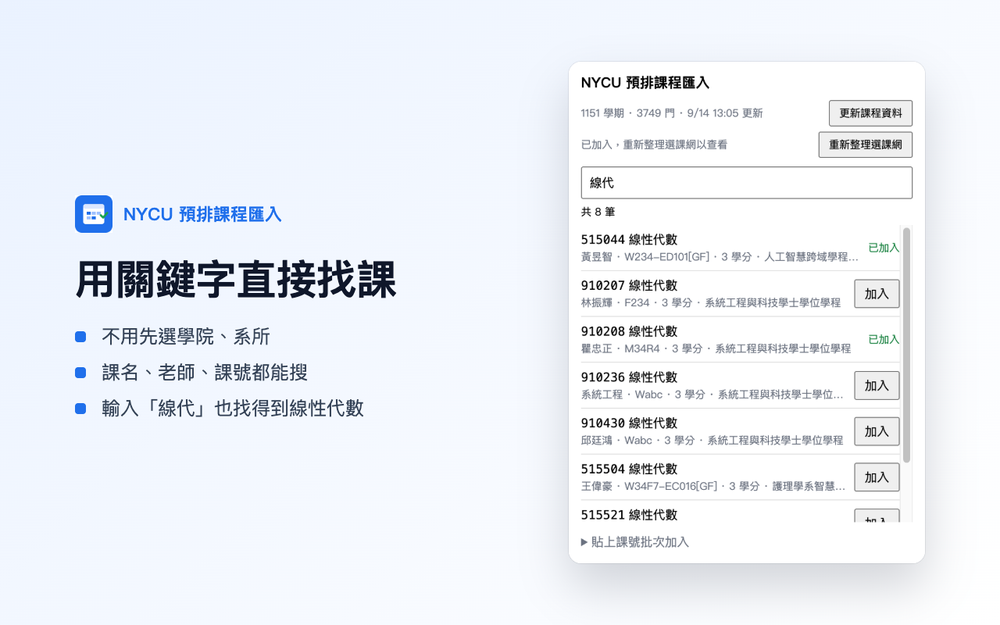
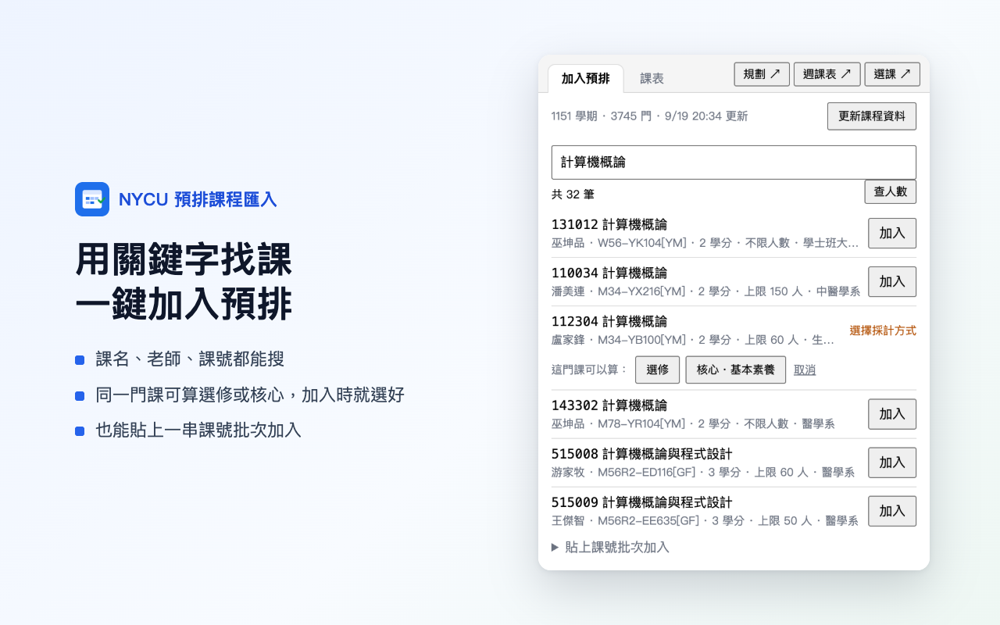
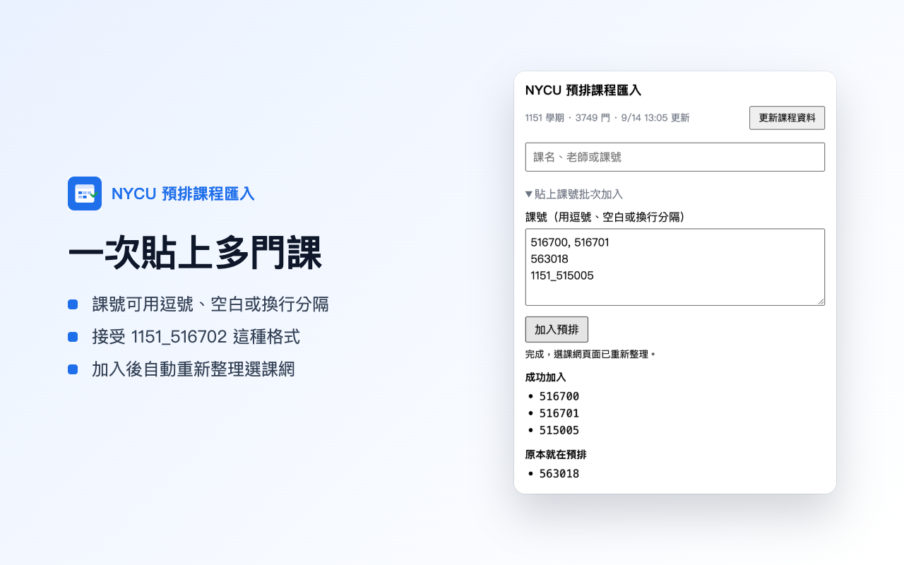

# NYCU 預排課程匯入

陽明交大選課系統的「預排課程」頁面，一定要先選學院、系所才找得到課。

這個 Chrome 擴充功能讓你**直接輸入課名、老師或課號搜尋全校課程**，找到後按「加入」，課就會放進選課系統的預排課程。

> 預排課程不是正式選課。正式選課請依學校公告，在選課系統上操作。
>
> 本工具不是學校官方工具。

## 安裝

### 從 Chrome 線上應用程式商店安裝（推薦）

到 [Chrome 線上應用程式商店](https://chromewebstore.google.com/detail/looiljidkdllkbabaiamgeblekkdgfef) 按「加到 Chrome」。之後會自動更新。

### 安裝 GitHub 最新版

商店的新版本要等 Google 審查，通常比 GitHub 晚幾天到幾週。想馬上用到最新功能，可以改裝 GitHub 上的最新版：

> 商店版和 GitHub 版**只能裝一個**。兩個都裝會出現兩個一樣的圖示，互相干擾。換版本前，先到 `chrome://extensions` 移除原本那個。課程資料和課表存在擴充功能裡，移除後要重新「更新課程資料」和「從選課網同步」。

1. 到 [最新版下載頁](https://github.com/engelyu/nycucourse-extension/releases/latest)，下載 `nycucourse-extension-版本.zip`。
2. 把 zip 解壓縮到一個**不會刪掉或移動**的資料夾，例如「文件」裡面。
3. 在 Chrome 網址列輸入 `chrome://extensions` 並按 Enter。
4. 打開右上角的「開發人員模式」。
5. 按左上角「載入未封裝項目」，選剛才解壓縮出來、裡面有 `manifest.json` 的那個資料夾。
6. 點瀏覽器右上角的拼圖圖示，把「NYCU 預排課程匯入」旁邊的圖釘按下去，圖示就會一直顯示在工具列上。

Edge、Brave 等以 Chrome 為基礎的瀏覽器通常也能用同樣方式安裝，但目前只在 Chrome 上測試過。手機瀏覽器不支援。

#### 更新 GitHub 版

GitHub 版不會自動更新。有新版時：

1. 下載新版 zip，解壓縮後**覆蓋**原本的資料夾。
2. 到 `chrome://extensions`，在「NYCU 預排課程匯入」按重新載入的圓形箭頭。
3. 重新整理選課網的分頁。

## 使用方式

### 第一次使用：下載課程資料

1. 點工具列上的擴充功能圖示。
2. 按「更新課程資料」。
3. 會看到下載進度，大約需要 1 到 3 分鐘。這段時間可以先關掉視窗，下載會在背景繼續。

課程資料會存在你的電腦裡，之後搜尋不需要再等。開學後如果有加開或異動的課，再按一次「更新課程資料」即可。

### 搜尋並加入預排

1. 登入 [選課系統](https://cos.nycu.edu.tw/)，打開「預排課程」頁面。
2. **停在選課系統的分頁上**，再點擴充功能圖示。
3. 在搜尋框輸入關鍵字，例如：
   - 課名：`線性代數`，也可以只打 `線代`
   - 老師：`吳金典`
   - 課號：`516700`，或打前幾碼 `5167`
4. 每筆結果會顯示老師、上課時間、學分、人數上限與開課單位。點課名可以開啟學校課程時間表的課程大綱。
5. 在想要的課右邊按「加入」。
6. 加完後按「重新整理選課網」，就能在預排課程區看到剛加入的課。

人數上限來自學校的課程時間表，時間表沒有公開「已選人數」。想看目前選了幾個人，停在選課網分頁按搜尋框右邊的「查人數」，擴充功能會向選課系統查目前顯示這幾門課的人數，額滿會標示出來。同一個系所五分鐘內只查一次，不會一直打學校的伺服器。

### 一次加入很多門課

如果手上已經有一串課號，例如從交大課程助手複製來的：

1. 展開視窗下方的「貼上課號批次加入」。
2. 把課號貼進去，用逗號、空白或換行分開都可以，`1151_516702` 這種格式也可以。
3. 按「加入預排」。

完成後會分成「成功加入」「原本就在預排」「失敗」列出來。只要有課成功加入，選課系統的頁面就會自動重新整理。

### 我的課表

點擴充功能圖示右上角的「我的課表」，會開啟課表分頁。

1. 先在選課網分頁登入，回到課表分頁按「從選課網同步」。
2. 上方可以切換「正式選課」「預排課程」「全部」。
3. 課表存在你的電腦裡，之後不必停在選課網也看得到，上課中想確認下一節在哪間教室很方便。
4. 點課表上的課會開啟該課的課程大綱。

節次時間與學校一致，例如第 3 節是 10:10 到 11:00。

**自己新增行程**：按「新增行程」，可以加外校課程、社團、打工或每週固定活動。時間可以選節次，也可以直接填時間，例如週三 19:00 到 20:30。每筆都能填自己的連結和顏色。

**幫課程設定連結**：把滑鼠移到課表上的課，右上角會出現鉛筆圖示。可以改成自己的連結，例如該課的 E3 頁面，也可以換顏色或隱藏。這些設定在重新同步後仍然保留。

### 正式選課

點擴充功能的「選課」會開啟選課分頁，列出你的預排課程。

1. 按「查詢」，擴充功能會向選課網確認這門課能不能加選，顯示人數、衝堂數與學校給的訊息。
2. 可以加選時按鈕會變成「加選」，按下後要再確認一次才會送出。
3. 體育、通識這類需要志願序的課，確認視窗會列出五個志願、各志願目前登記人數，選好才能送出。
4. 送出結果直接顯示選課網的回覆，成功後該門課會標示「已選上」。

這是**正式選課**，會真的改變你的選課結果。擴充功能不會自動連續送出，也不會自動重試，一切都要你自己按。目前沒有提供退選，要退選請到選課系統操作。

### 每日自動登記

加退選期間每天中午開放登記、隔天早上關閉，系統再跑分發，所以想要的課每天都得重新登記一次。選課分頁下方的「每日自動登記」可以幫你做這件事。

1. 從預排課程選一門加入清單，需要志願序的課順便選第幾志願。
2. 設定時間，例如 13:00，然後打開「每天自動登記」。
3. 想先看看結果可以按「立刻執行一次」。

規則與限制：

- 每天只跑一次，每門課只送一次，失敗不會重試。
- 已經選上的課會自動跳過；已登記且志願相同的也跳過，志願不同才會重登。
- 執行時電腦要開著、Chrome 要在執行中，而且選課網要保持登入。登入過期時不會亂送，會在紀錄裡說明。
- 執行前會先問選課系統是否暫停，暫停中就不送出，並把學校公告的暫停時間記在紀錄裡。
- 沒有開著的選課網分頁時，會自己開一個背景分頁來用。
- 每次執行的結果都留在清單下方，工具列圖示也會顯示成功門數。

## 看到這些訊息時

| 訊息 | 意思與處理方式 |
|---|---|
| 切到選課網分頁才能加入預排 | 目前的分頁不是選課系統。按「開啟選課網」，或切到已經開著的選課系統分頁，再點一次擴充功能圖示。 |
| 請重新整理選課網分頁後再開啟 | 剛裝好或剛更新擴充功能時會出現。重新整理選課系統的分頁，再點一次擴充功能圖示。 |
| 請先登入選課網 | 選課系統的登入已經過期（大約 8 小時）。重新登入選課系統後再試。 |
| 選課預選失敗 | 這個課號在選課系統上找不到，可能打錯了，或這門課已經停開。 |
| 已在預排 | 這門課原本就在你的預排課程裡，不需要再加。 |
| 學校網站回應較慢，仍在等待中 | 更新課程資料時學校網站比較慢，不是當掉，請繼續等。 |
| 上次更新中斷，請重新按更新 | 下載途中被中斷，例如電腦睡眠或瀏覽器關閉。再按一次「更新課程資料」。 |
| 有 N 個系所沒抓到，課程可能不完整 | 更新時有少數系所連不上，其他課程已經存好。可以照常使用，想補齊就稍後再更新一次。 |
| 更新失敗…（已保留原本的課程資料） | 學校網站暫時沒有回應。原本的資料還在，可以照常搜尋，晚點再按更新。 |
| 選課系統暫停中：… | 選課系統正在跑分發或暫停使用，後面接的是學校公告的原文與時間，例如「分發時間 10:00～12:00 暫停使用選課系統」。這段時間加選、登記和自動登記都不會送出，等時間過了再試。 |
| 選課網狀態：… | 選課系統回報負載偏高等狀態。系統正常時不會顯示。 |
| 注意：課程資料是某學期，選課網目前是另一個學期 | 課程資料不是這學期的，同一個課號可能是不同的課。請先按「更新課程資料」再加入。 |

## 常見問題

**會不會幫我正式選課？**
不會。它只會把課放進「預排課程」，跟你自己在選課系統按「加入預排課程」一樣。

**其他系、研究所、陽明校區的課也能加嗎？**
可以。預排課程沒有系所、年級或校區限制，衝堂或額滿的課也可以放進預排。

**要不要另外輸入帳號密碼？**
不用。擴充功能只會用你在選課系統上已經登入的狀態，不會要你輸入密碼。

**會不會收集我的資料？**
不會。課程資料是從學校公開的課程時間表下載，存在你自己的電腦裡。加入預排時只會連到學校的選課系統，不會傳到任何其他地方。詳細內容請看 [隱私權政策](store/privacy.md)。

## 問題回報與建議

遇到問題或有想要的功能，歡迎到 [Issues](https://github.com/engelyu/nycucourse-extension/issues) 留言。回報時附上畫面截圖和當時看到的訊息，會比較快找到原因。

---

開發相關的設計文件放在 [docs](docs/) 資料夾。
